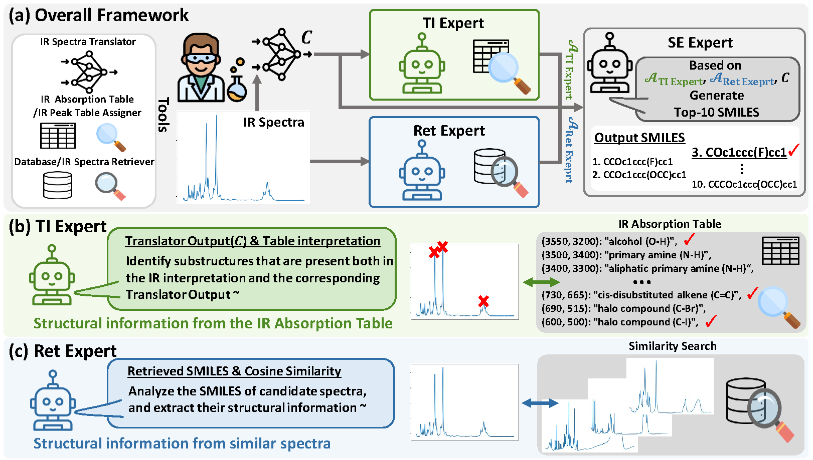

# IR-Agent: Expert-Inspired LLM Agents for Structure Elucidation from Infrared Spectra
The official source code for IR-Agent: Expert-Inspired LLM Agents for Structure Elucidation from Infrared Spectra, submitted to the NeurIPS 2025 main conference.
### Overview
Spectral analysis provides crucial clues for the elucidation of unknown materials. Among various techniques, infrared spectroscopy (IR) plays an important role in laboratory settings due to its high accessibility and low cost. However, existing approaches often fail to reflect expert analytical processes and lack flexibility in incorporating diverse types of chemical knowledge, which is essential in real-world analytical scenarios. In this paper, we propose IR-Agent, a novel multi-agent framework for molecular structure elucidation from IR spectra. The framework is designed to emulate expert-driven IR analysis procedures and is inherently extensible. Each agent specializes in a specific aspect of IR interpretation, and their complementary roles enable integrated reasoning, thereby improving the overall accuracy of structure elucidation. Through extensive experiments, we demonstrate that IR-Agent not only improves baseline performance on experimental IR spectra but also shows strong adaptability to various forms of chemical information.

### Overall Framework of IR-Agent
  

### Dataset
Due to file size and copyright restrictions, we provide the code for data downloading and preprocessing, including the NIST IDs used in our dataset and the data split indices.

`dataset_utils/download_data.py`: Code for Preprocessing IR Data  
`dataset_utils/preprocess_data.py`: Code for Downloading IR Data  
`dataset_utils/random_split.py`: Code for Random Splitting of IR Data  
`dataset_utils/peak_dict.py`: Peak Wavenumbers in IR Data  
`dataset_utils/nist_id_dict.json`: NIST IDs of the Datasets

### Run IR-Agent
`run_multi_agent_ir.py`: Main Code for Running IR-Agent    

### Tools
`models/translator.py`: Translator model for generating candidiate SMILES  
`utils_table.py`: IR peak table assigner & IR absorption table  
